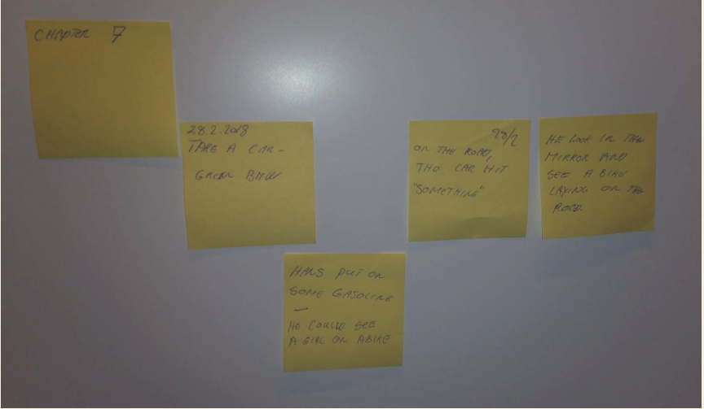

# The case

> ## Author idea generation tool/ Story line tool.
>
> ​	Many authors begin new work by collecting 
> ==small notes, which are written on Post-its or event-cards==. 
> ==On each event-card, individual words are noted==, 
> just so that the author can remember the given event. The notes on the event-cards are saved and will eventually 
> ==be used later in a story==.
>
> ​	When the author 
> ==gets a basic idea for a story==, 
> the author will 
> ==lead in his pile of notes and find the notes of events that fit the story.== 
> The author will 
> ==lay the events in extension of each other like a tile walk and give the direction of the story==. 
> ==Pulling in a new event can give a changed direction of the story==. 
> ==A pile of post-it or event-cards can be used for multiple ideas, as many writers take multiple approaches to a novel.==
> 
> <u>When the author begin to write a novel, he or she will pick up the event cards and draw them up on a timeline</u> 
>
> see figure 1.
>
> 
>
> Andrej's good example : https://youtu.be/xeIWy3ES9wg?t=60
>
> There are 
> ==several levels of event cards== 
> so that one event card can be under another card. This means that there can be a hierarchy in each chapter. The user must be able to set once all the event cards are placed. The program should offer a number of options. 
> ==1==. save the story for later editing 
> ==2==. print the events chronologically 
> ==3==. Export to a text with all events chronologically and in level.
>
> 
>
> In some cases, authors work together, in others it is a single-user project. This means that the solution must be able to run as a 
> ==multi-user system with a central database== 
> and as 
> ==<u>a single user</u> <u>without the use of a central database</u>==. 
> Construct a layered 
> ==architecture==, 
> with separation of concerns. Use 
> ==JavaFX for GUIs== 
> and when relevant use 
> ==appropriate design patterns.== 
> ==Demonstrate how databinding can be applied in at least one scene==.

# Technology and Business:

How could a Business Model for this software product look like? In your answer the following should be included:

- The Business Model Canvas.
- Examples of similar software that might be a competitor.
- An answer to what value the product creates for the user.

# System development:

Use Unified process as method and add the artifacts to the report
In your answer, the following should de included:

- List of Use-cases, domain model, Class diagram, SSD.
- Time estimation and reflections on the estimated values.
- Pictures of the throw away prototype, documentation of the usability
- inspection and recommendations of improvements.

# Programming:

Construct a layered architecture, with separation of concerns. Use JavaFX for GUIs and when relevant use appropriate design patterns.
==Include in the report:==

- The ==architectural== diagram showing packages.
- ==Code snippets== of interesting pieces of code including ==text explaining== the design pattern used (if relevant).
- Database creation ==scripts== and code for the ==stored procedures== etc. (these can be placed in the appendix).
- ==Test code==, and a short explanation of the principles used when writing the test
  code.
- ==Design Class Diagrams== - just place an excerpt in the report.
- ==Sequence diagram==s demonstrating the order of actions on the finished code.
- ==An overall discussion of the design patterns== used in this project.
- ==A working link to your GIT repository== – after the project is handed-in no group members can change the code. It is also a good idea to place a short explanation of how you have been using version control and management of code.